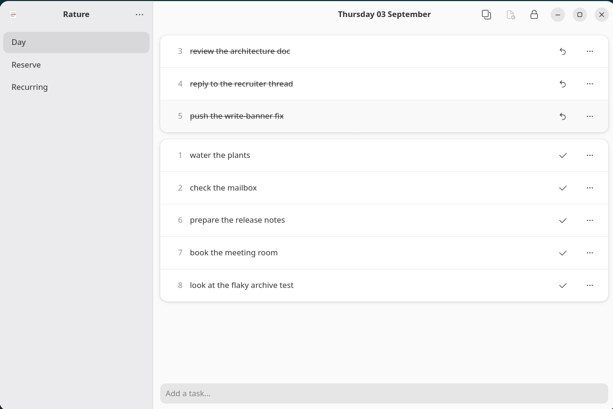
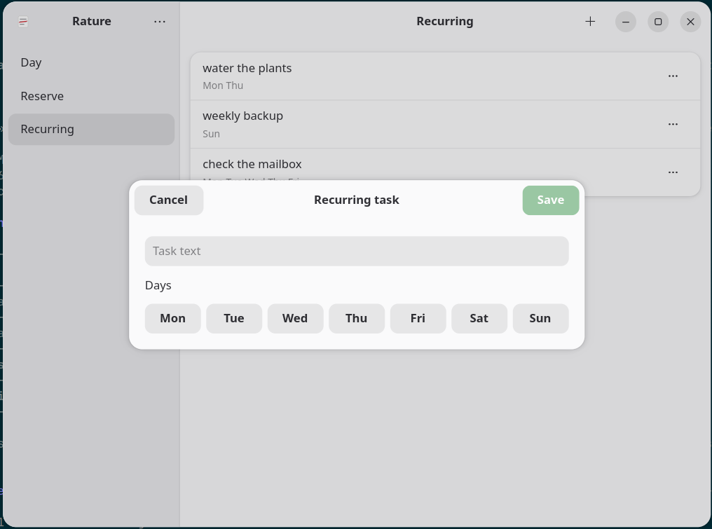
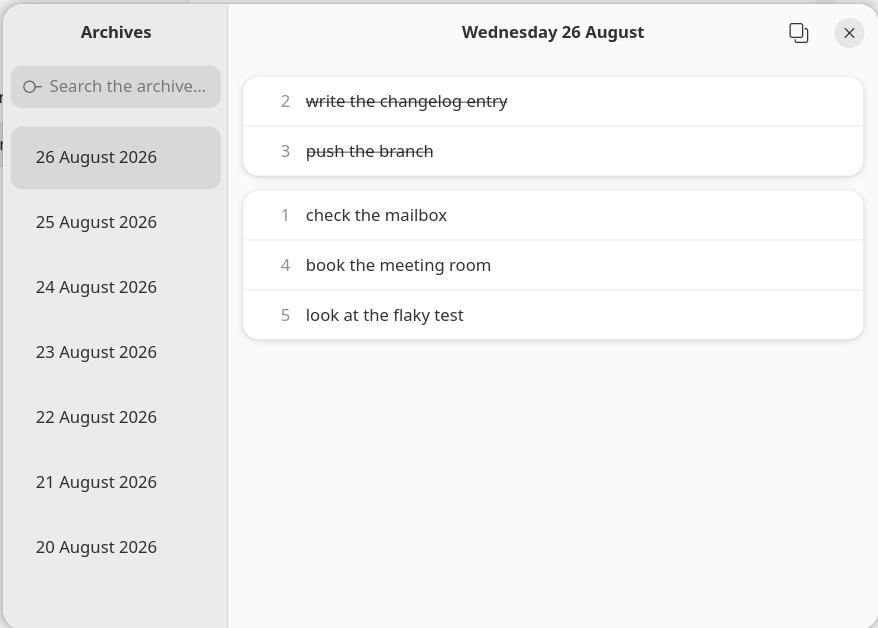
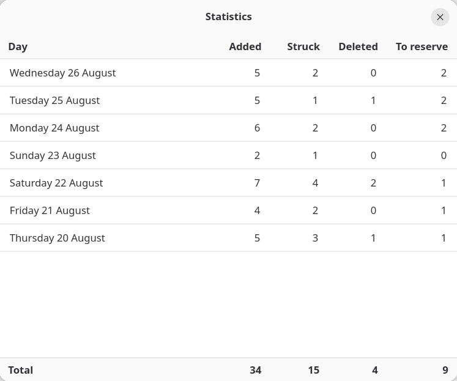

# Rature

A daily-list desktop application for GNOME. Your day, one line at a time.

## What it is

Rature keeps one numbered list for the day. You add tasks one by one, in no
particular order, and strike them through as the day goes. Struck tasks stay
visible in a block at the top, as a trace of what got done. There is no
planning, no categories, no scoring, no encouragement. Rature is a support,
not a coach.

The method it reproduces:

- Tasks are dictated one at a time, in bulk, with no imposed order.
- Each task joins a numbered list, without comment.
- Striking a task bars it and moves it to a "Struck" block at the top.
- Deleting a task removes it without a visible trace. It is distinct from
  striking: an abandonment, not an achievement. The two actions are never
  merged.
- The list can be frozen to end the composition of the day while striking,
  renaming and reordering stay possible.

## Features

- **Day view** — add, strike, unstrike, rename in place, delete, reorder by
  drag-and-drop, freeze the list. `Shift+Enter` logs a task already struck.
- **Reserve** — an undated list you draw from in the morning; unfinished
  day tasks return to it at the day rollover.
- **Recurring** — task templates tied to weekdays, injected automatically
  each new day.
- **Archives window** — every past day, read-only, with a search over task
  text.
- **Statistics window** — a plain table of counts per archived day, no
  chart and no judgement.
- **Undo the last deletion**, **copy a day as plain text**, keyboard
  shortcuts with a help window, and a full French translation.

## Screenshots






## Status

Pre-release, built from a written specification. Milestones 0 to 4 are done:
the business logic, the three views, the Archives and Statistics windows,
keyboard shortcuts, plain-text export and the French translation. Milestone
5, publication, is in progress; `0.10.0` is not cut yet.

Built with AI assistance (Claude Code); the author writes the
specification, reviews every change, and merges it.

Design decisions and the roadmap live under `docs/internal/` (in French).
The architecture is [`docs/ARCHITECTURE.md`](docs/ARCHITECTURE.md).

## Building from source

Requires Meson, GTK 4, libadwaita, GLib and the gettext tools, and Python
3.13 or newer.

```
meson setup build
meson compile -C build
meson install -C build
```

Run the checks:

```
meson test -C build
```

### Flatpak

```
flatpak-builder --user --install --force-clean build-flatpak \
  build-aux/flatpak/io.github.vertours.Rature.yml
flatpak run io.github.vertours.Rature
```

## Installing

Not published yet. Milestone 5 will provide a self-hosted Flatpak
repository (with automatic updates), a standalone `.flatpak` bundle on each
release, and AUR and COPR packages. Flathub is deliberately not a target.

## Contributing

See [CONTRIBUTING.md](CONTRIBUTING.md).

## License

GPL-3.0-or-later. See [LICENSE](LICENSE).
