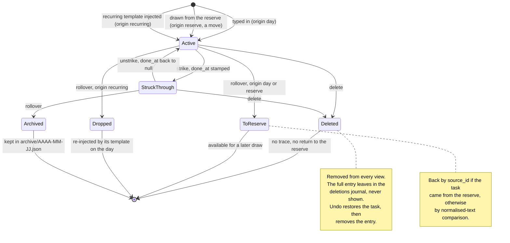

# Architecture

Where things live, and why. Updated whenever the structure changes.

---

## The rule that matters

**`core/` knows nothing about the graphical interface.** No file under
`core/` imports `gi`, GTK, Adw or Gdk. If a function needs GTK, it does not
belong in `core/`. The reasoning and its consequences are in
[`docs/adr/0002-separation-core-ui.md`](adr/0002-separation-core-ui.md).

---

## Layout

```
rature/
├── src/rature/
│   ├── core/                   Business logic, zero GTK
│   │   ├── models.py           Task, ReserveItem, RecurringItem, Deletion
│   │   ├── session.py          Rules: add, strike, day rollover
│   │   ├── recurrence.py       Which recurring templates apply today
│   │   ├── storage.py          XDG paths, atomic JSON writes, archiving
│   │   ├── migrations.py       Version-to-version migration base
│   │   ├── app.py              Coordination: App, one Session, one clock
│   │   ├── export.py           Render a day as plain text (§3.12)
│   │   ├── search.py           Case- and accent-insensitive archive search (§3.13)
│   │   └── stats.py            Per-day archive counters (§3.14)
│   ├── ui/                     Everything that touches GTK
│   │   ├── application.py      Adw.Application, actions, shortcuts
│   │   ├── window.py           Main window, App, timer, navigation
│   │   ├── day_view.py         Day view, SPECIFICATION.md §3.2
│   │   ├── task_row.py         Row shared by both Day-view blocks
│   │   ├── reserve_view.py     Reserve view, §3.3
│   │   ├── reserve_row.py      Reserve row: send button, drag source
│   │   ├── recurring_view.py   Recurring view, §3.4
│   │   ├── recurring_form.py   AdwDialog to create/edit a recurring task
│   │   ├── recurring_row.py    Recurring row: text and weekday subtitle
│   │   ├── archives_window.py  Archives window, §3.5, with search
│   │   ├── archive_date_row.py Sidebar date entry of the Archives window
│   │   ├── archive_task_row.py Read-only task row of the Archives window
│   │   ├── statistics_window.py Statistics window, §3.14
│   │   ├── statistics_row.py   One table row of the Statistics window
│   │   ├── inline_rename.py    In-place rename, shared by the list views
│   │   ├── list_helpers.py     GtkListBox plumbing shared by the views
│   │   ├── reorder.py          Where a drag-and-drop reorder lands (no gi)
│   │   └── weekdays.py         Locale weekday names via strftime (no gi)
│   ├── i18n.py                 Launcher locale helpers (no gi)
│   └── main.py                 Process entry point
├── data/
│   ├── ui/                     One .ui per @Gtk.Template module, same name
│   ├── icons/
│   ├── *.desktop.in
│   ├── *.metainfo.xml.in
│   └── *.gschema.xml           Window geometry settings
├── po/                         LINGUAS, POTFILES.in, fr.po
├── tests/                      pytest: core/, launcher wiring, packaging
├── build-aux/flatpak/          Flatpak manifest
├── docs/
├── meson.build
└── pyproject.toml              ruff and pytest configuration
```

---

## What each layer does

### `core/models.py`
Pure data structures, no complex behaviour: `dataclass`es that serialise to
a dict and back, and validate their own invariants on construction. Nothing
else.

### `core/session.py`
The heart of the rules. Holds one day's state and the operations on it:
add, strike, unstrike, rename, delete, reorder, lock, send to the reserve,
draw from the reserve, roll over to the next day.

Drawing from the reserve is a move, never a copy. The item leaves the
reserve and its id is kept in the created task's `source_id`, so an
unfinished task can be put back at the next rollover.

Reads and writes no file. Takes and returns objects, and every operation
that needs the time takes `now`/`today` as a parameter.

### `core/storage.py`
XDG paths, reading, atomic writing, archiving. The atomic-write procedure,
directory `fsync` included, is in
[`docs/adr/0003-fichier-json-unique.md`](adr/0003-fichier-json-unique.md).

`list_archives` returns the dates present in `archive/`, most recent first,
by reading file names only: it opens no content and cannot fail on a
damaged archive (a name shaped like a date but impossible, such as
`2026-02-30.json`, is skipped). `load_archive` reads, migrates and returns
a `Day`, letting the error propagate if the file is unreadable.

### `core/migrations.py`
One function per version jump, each with its own test over a sample of the
previous version's data.

The format is born at version 1 with the reserve and the recurring
templates. There is no migration to write yet, but the base exists from day
one: adding it later, over real data, is far riskier.

### `core/app.py`
`App` coordinates a `Session` with `storage` behind a single injectable
clock (`clock`, a `Callable[[], datetime]`, the system clock by default).
It is the project's only clock seam: `session.py` and `storage.py` always
receive `now`/`today` as arguments and never read the time themselves.

`App.open` loads the file or creates one on first launch, quarantines an
unreadable file (`storage.quarantine`) and starts empty, and lets
`migrations.FutureVersionError` pass through without building anything for a
future version. Before returning it always runs `ensure_day`, the
`roll_over` then `archive` then `save` sequence of `SPECIFICATION.md` §2.5:
the caller always gets an `App` already up to date and never has to know or
replay that sequence.

`ensure_day` returns an `EnsureResult(outcome, archived)`. `outcome` is
`IDLE` (nothing due, nothing pending), `SAVED` (a write reached disk) or
`SAVE_FAILED` (a write raised `OSError`); `archived` is the day a rollover
archived, or `None`. A failed save is reported, not raised: it sets
`App.save_pending` and a later `ensure_day` retries the write with no
second `roll_over` and no second `archive`. `archives` and `read_archive`
are the archive-reading passthroughs; `ui/` never calls `storage` directly.
`archive_matches`, `statistics`, `day_text` and `archived_day_text`
likewise wrap `core/search`, `core/stats` and `core/export` so `ui/`
imports only `rature.core.app`.

A per-mutation wrapper over `Session` (`add`, `strike`, `delete`,
`move_before`, `add_to_reserve`, ...) supplies `now`/`today` from `clock`
and saves afterwards. Business errors (`LockedError`, `KeyError`,
`ValueError`) propagate as-is; `App` does not swallow them. A save that
fails mid-mutation does not undo the in-memory mutation, a deliberate
decision documented on the class itself.

A graphical application can be written calling only `App`: no
product-behaviour decision is left to make in `ui/`.

### `ui/`
Holds no business rule. It shows the state `core/` provides and forwards
the user's actions, nothing more. A business condition you are tempted to
write in `ui/` belongs in `core/`.

Each `.ui` has the same name as the Python module that loads it
(`task_row.py` ↔ `data/ui/task_row.ui`), underscore included. Every
`@Gtk.Template` class sets its `__gtype_name__` explicitly, prefixed
`Rature`: GObject type names are a process-global namespace and a clash
only shows at launch.

`reorder.py`, `weekdays.py` and `rature/i18n.py` import no `gi` and are
unit tested directly; the rest of `ui/` is covered structurally
(`tests/test_ui_wiring.py`) and by a human looking at the running app
(`CLAUDE.md` §6).

---

## Data flow

```
user -> ui -> app (core) -> session and storage (core) -> disk
                 |
                 v
             ui redraws
```

The interface never changes state directly. It calls an `app` method, then
asks `app` for the state to display again (`app.session`).

---

## Data model

One versioned file, in `$XDG_DATA_HOME/rature/`.

```json
{
  "version": 1,
  "date": "2026-08-24",
  "counter": 12,
  "locked": false,
  "tasks": [
    {"id": "uuid", "num": 1, "text": "...", "done": true,
     "done_at": "2026-08-24T14:32:07+02:00",
     "origin": "day|reserve|recurring",
     "source_id": null, "source_created": null, "template_id": null}
  ],
  "reserve": [
    {"id": "uuid", "text": "...", "created": "2026-08-20"}
  ],
  "recurring": [
    {"id": "uuid", "text": "...", "weekdays": [0,1,2,3,4]}
  ],
  "deletions": [
    {"id": "uuid", "num": 4, "text": "...", "origin": "day", "index": 1,
     "source_id": null, "source_created": null, "template_id": null,
     "done": false, "done_at": null,
     "deleted_at": "2026-08-24T14:32:07+02:00"}
  ]
}
```

Task fields:

| Field | Role |
|---|---|
| `id` | uuid, present from version 1. Needed by undo-delete and the link back to the reserve |
| `num` | display label, immutable, independent of order |
| `done_at` | local ISO timestamp of the strike, `null` otherwise. A strike records what was done; when matters too |
| `origin` | `day`, `reserve` or `recurring` |
| `source_id` | uuid of the originating reserve item, `null` otherwise. It, not the text, drives the return to the reserve. Non-null if and only if `origin` is `reserve`: `core/models.py` rejects a `reserve` task built without `source_id` |
| `source_created` | `created` date of the originating reserve item, copied at draw time, `null` otherwise. Read back at rollover to restore the item with its original date. Same constraint as `source_id` |
| `template_id` | uuid of the originating recurring template, `null` otherwise |

A `deletions` entry adds two fields to the task fields of the same name
(`id`, `num`, `text`, `origin`, `source_id`, `source_created`,
`template_id`, plus `deleted_at`):

| Field | Role |
|---|---|
| `index` | the task's position in `day.tasks` when it was deleted, to reinsert it in the same place on undo |
| `done`, `done_at` | strike state at deletion time, to restore a struck task as it was |

`weekdays` is never empty, see `SPECIFICATION.md` §2.7.2. Monday is 0;
"every day" is `[0,1,2,3,4,5,6]`.

`done_at` and `deleted_at` always carry their UTC offset, see
`SPECIFICATION.md` §2.7.6. The `created` field of reserve items and the
`source_created` field of tasks stay plain dates, no time.

`deletions` is the deletion journal of `SPECIFICATION.md` §2.2. It keeps
the full entry, text included, so undo-delete can restore the task exactly.
It follows the current day and then leaves in its archive file. It is never
shown; the Statistics window reads only a count from it.

Archived days go to `<data>/archive/AAAA-MM-JJ.json`. The file name is the
archived day's own `date`, never the system date at archiving time, see
`SPECIFICATION.md` §2.7.5. Each archive file carries a `version` field like
the main file.

Archiving overwrites a file of the same date on purpose. The caller
archives first and saves second; a crash between the two replays the
rollover on the next launch and rewrites the same archive with the same
content. That idempotence backs the "no data is lost" guarantee of
`SPECIFICATION.md` §2.5. Since the rollover refuses to run until the
reference date has advanced, two distinct days can never share an archive
date.

---

## Day rollover rules

Specified in `SPECIFICATION.md` §2.5, including the reference date and the
04:00 boundary. Single source, not copied here. In code they live in
`core/session.py` and `core/recurrence.py`, and none of them reaches
`ui/`.

---

## Task lifecycle

Every transition. An arrow with no destination would flag a case the
specification has not settled.



An unstruck task is archived with the day at the same time as it goes to
the reserve or is dropped. The archive is a snapshot of the day, not an
exclusive destination.

---

## Deliberately absent

Simplicity decisions, not to be revisited without a strong reason.

- No due dates, priorities or tags
- No sub-tasks
- No database; one JSON file is enough at this scale. See
  [`docs/adr/0003-fichier-json-unique.md`](adr/0003-fichier-json-unique.md)
- No network sync, mobile client or external capture file. See
  `docs/internal/ROADMAP.md`, "Repoussé volontairement"
- No runtime dependency beyond the GNOME runtime and the Python standard
  library. See `CLAUDE.md` §4 rule 6
