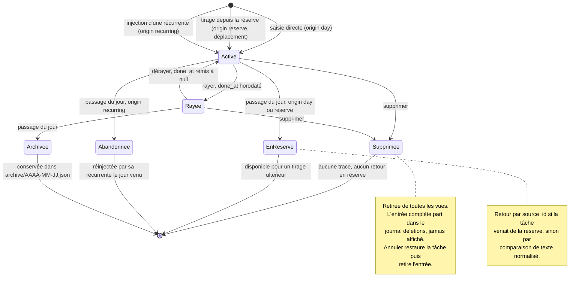

# Architecture

Ce document dit où vit quoi, et pourquoi. Il est mis à jour dès que la
structure change.

---

## La règle qui compte

**`core/` ne connaît pas l'interface graphique.**

Aucun fichier de `core/` n'importe `gi`, GTK, Adw ou Gdk. Conséquences :

- La logique se teste sans écran, donc en intégration continue
- Un bug se reproduit dans un test de dix lignes, pas en cliquant
- L'interface peut être refaite sans toucher aux règles métier
- Le code se relit sans connaître GTK

Si une fonction a besoin de GTK, elle n'appartient pas à `core/`.

---

## Arborescence

```
rature/
├── src/rature/
│   ├── core/                   Logique métier, zéro GTK
│   │   ├── models.py           Task, ReserveItem, RecurringItem
│   │   ├── session.py          Règles : ajout, rayure, passage du jour
│   │   ├── recurrence.py       Quelles récurrentes s'appliquent aujourd'hui
│   │   ├── storage.py          Lecture et écriture atomique du JSON
│   │   └── migrations.py       socle de migration entre versions
│   ├── ui/                     Tout ce qui touche GTK
│   │   ├── application.py      Adw.Application, actions, raccourcis
│   │   ├── window.py           Fenêtre principale, navigation latérale
│   │   ├── day_view.py
│   │   ├── reserve_view.py
│   │   ├── recurring_view.py
│   │   └── archive_window.py
│   └── main.py                 Point d'entrée
├── data/
│   ├── ui/                     Fichiers .ui GTK Builder
│   ├── icons/
│   ├── *.desktop.in
│   ├── *.metainfo.xml.in
│   └── *.gschema.xml           Préférences, si besoin
├── po/                         LINGUAS, POTFILES.in, fr.po
├── tests/                      pytest : core/, empaquetage, versions
├── build-aux/flatpak/          Manifeste Flatpak
├── docs/
├── meson.build
└── pyproject.toml              Configuration ruff et pytest
```

---

## Rôle de chaque couche

### `core/models.py`
Structures de données pures, sans comportement complexe. Des `dataclass`.
Sérialisation vers dictionnaire et retour, rien d'autre.

### `core/session.py`
Le coeur des règles. Contient l'état d'une journée et les opérations :
ajouter, rayer, dérayer, renommer, supprimer, réordonner, verrouiller,
envoyer en réserve, tirer de la réserve, passer au jour suivant.

Tirer de la réserve est un déplacement, jamais une copie. L'item quitte la
réserve et son identifiant est conservé dans le `source_id` de la tâche
créée, ce qui permet de l'y remettre au passage du jour.

Ne lit ni n'écrit aucun fichier. Reçoit et rend des objets.

### `core/storage.py`
Chemins XDG, lecture, écriture atomique, archivage.

Écriture atomique : écrire dans un fichier temporaire situé dans le même
répertoire (donc le même système de fichiers), appeler `flush` puis
`os.fsync` sur ce fichier, le fermer, faire `os.replace` vers le nom
définitif, puis `os.fsync` sur le descripteur du répertoire. Sans le `fsync`
du répertoire, le renommage peut être perdu lors d'une coupure et la
garantie annoncée est fausse.

### `core/migrations.py`
Une fonction par saut de version. Chaque migration a son test avec un
échantillon de données de la version précédente.

Le format naît en version 1 avec la réserve et les récurrentes. Aucune
migration à écrire au démarrage, mais le socle existe dès le premier jour :
l'ajouter après coup sur des données réelles est autrement plus risqué.

### `ui/`
Ne contient aucune règle métier. Affiche l'état fourni par `core/`,
transmet les actions de l'utilisateur, rien de plus. Si vous êtes tenté
d'écrire une condition métier dans `ui/`, elle va dans `core/`.

---

## Flux de données

```
utilisateur -> ui -> session (core) -> storage (core) -> disque
                        |
                        v
                    ui rafraîchit l'affichage
```

L'interface ne modifie jamais l'état directement. Elle appelle une méthode
de `session`, puis redemande l'état à afficher.

---

## Modèle de données

Fichier unique, versionné, dans `$XDG_DATA_HOME/rature/`.

```json
{
  "version": 1,
  "date": "2026-08-24",
  "counter": 12,
  "locked": false,
  "tasks": [
    {"id": "uuid", "num": 1, "text": "...", "done": true,
     "done_at": "2026-08-24T14:32:07+02:00",
     "origin": "day|reserve|recurring",
     "source_id": null, "template_id": null}
  ],
  "reserve": [
    {"id": "uuid", "text": "...", "created": "2026-08-20"}
  ],
  "recurring": [
    {"id": "uuid", "text": "...", "weekdays": [0,1,2,3,4]}
  ],
  "deletions": [
    {"id": "uuid", "num": 4, "text": "...", "origin": "day",
     "source_id": null, "deleted_at": "2026-08-24T14:32:07+02:00"}
  ]
}
```

Champs des tâches :

| Champ | Rôle |
|---|---|
| `id` | uuid, présent dès la version 1. Nécessaire à l'annulation de suppression et au lien vers la réserve |
| `num` | étiquette d'affichage, immuable, indépendante de l'ordre |
| `done_at` | horodatage ISO local de la rature, `null` sinon. La rature est une trace de ce qui a été fait, encore faut-il savoir quand |
| `origin` | `day`, `reserve` ou `recurring` |
| `source_id` | uuid de l'item de réserve d'origine, `null` sinon. C'est lui, et non le texte, qui pilote le retour en réserve |
| `template_id` | uuid de la récurrente d'origine, `null` sinon |

`weekdays` ne peut pas être vide, voir `CLAUDE.md` §2.7.2. Lundi vaut 0.
« Tous les jours » s'écrit `[0,1,2,3,4,5,6]`.

`done_at` et `deleted_at` portent toujours leur décalage horaire, voir
`CLAUDE.md` §2.7.6. Le champ `created` des items de réserve reste une date
simple, sans heure.

`deletions` est le journal de suppressions décrit dans `CLAUDE.md` §2.2. Il
conserve l'entrée complète, texte compris, ce qui permet à l'annulation de
suppression de restaurer la tâche à l'identique. Il suit la journée en cours
puis part dans son fichier d'archive.

Il n'est jamais affiché. La fenêtre Statistiques n'en tire qu'un nombre.
Annuler une suppression restaure la tâche depuis son entrée, puis retire
cette entrée.

Les journées archivées vont dans `<data>/archive/AAAA-MM-JJ.json`. La date du
nom de fichier est celle du jour archivé, jamais la date système au moment de
l'archivage, voir `CLAUDE.md` §2.7.5.

Chaque fichier d'archive porte un champ `version`, comme le fichier principal.
Si le fichier existe déjà, écrire `AAAA-MM-JJ-2.json`, puis `-3`, et ainsi de
suite. Ne jamais écraser une archive.

---

## Règles de passage au jour suivant

Spécifiées dans `CLAUDE.md` §2.5, y compris la définition de la date de
référence et la bascule de 04:00. Source unique, ne pas recopier ici.

Côté implémentation, ces règles vivent dans `core/session.py` et
`core/recurrence.py`. Aucune ne remonte dans `ui/`.

---

## Cycle de vie d'une tâche

Ce diagramme couvre toutes les transitions. Une flèche sans destination
signalerait un cas non tranché dans la spécification.



Une tâche non rayée est archivée avec la journée en même temps qu'elle part
en réserve ou qu'elle est abandonnée. L'archive est un instantané de la
journée, pas une destination exclusive.

---

## Ce qui est volontairement absent

Décisions de simplicité, à ne pas remettre en cause sans raison forte.

- Pas de base de données, un fichier JSON suffit à cette échelle
- Pas de dates d'échéance, ni de priorités, ni d'étiquettes
- Pas de synchronisation réseau, ni de compte
- Pas de client mobile, ni de fichier de capture externe. Décision prise le
  24 août 2026 : l'application est de bureau, sur un seul poste. Elle serait
  un autre projet autrement.
- Pas de sous-tâches
- Pas de dépendance d'exécution hors runtime GNOME et bibliothèque standard
  Python. Meson et gettext sont des dépendances de construction, ruff et
  pytest des dépendances de développement. Voir `CLAUDE.md` §4 règle 6
