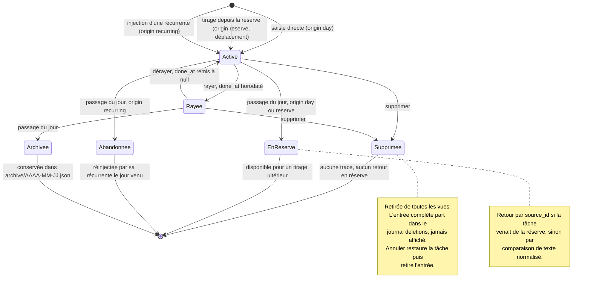

# Architecture

Ce document dit où vit quoi, et pourquoi. Il est mis à jour dès que la
structure change.

---

## La règle qui compte

**`core/` ne connaît pas l'interface graphique.** Aucun fichier de `core/`
n'importe `gi`, GTK, Adw ou Gdk. Si une fonction a besoin de GTK, elle
n'appartient pas à `core/`. Le pourquoi et ses conséquences :
`docs/adr/0002-separation-core-ui.md`.

---

## Arborescence

```
rature/
├── src/rature/
│   ├── core/                   Logique métier, zéro GTK
│   │   ├── models.py           Task, ReserveItem, RecurringItem
│   │   ├── session.py          Règles : ajout, rayure, passage du jour
│   │   ├── recurrence.py       Quelles récurrentes s'appliquent aujourd'hui
│   │   ├── storage.py          Lecture et écriture atomique du JSON
│   │   ├── migrations.py       socle de migration entre versions
│   │   └── app.py              Coordination : App, une Session, une horloge
│   ├── ui/                     Tout ce qui touche GTK
│   │   ├── application.py      Adw.Application, actions, raccourcis
│   │   ├── window.py           Fenêtre principale, navigation latérale
│   │   ├── day_view.py
│   │   ├── reserve_view.py
│   │   ├── recurring_view.py
│   │   └── archive_window.py
│   └── main.py                 Point d'entrée
├── data/
│   ├── ui/                     Fichiers .ui GTK Builder
│   ├── icons/
│   ├── *.desktop.in
│   ├── *.metainfo.xml.in
│   └── *.gschema.xml           Préférences, si besoin
├── po/                         LINGUAS, POTFILES.in, fr.po
├── tests/                      pytest : core/, empaquetage, versions
├── build-aux/flatpak/          Manifeste Flatpak
├── docs/
├── meson.build
└── pyproject.toml              Configuration ruff et pytest
```

---

## Rôle de chaque couche

### `core/models.py`
Structures de données pures, sans comportement complexe. Des `dataclass`.
Sérialisation vers dictionnaire et retour, rien d'autre.

### `core/session.py`
Le coeur des règles. Contient l'état d'une journée et les opérations :
ajouter, rayer, dérayer, renommer, supprimer, réordonner, verrouiller,
envoyer en réserve, tirer de la réserve, passer au jour suivant.

Tirer de la réserve est un déplacement, jamais une copie. L'item quitte la
réserve et son identifiant est conservé dans le `source_id` de la tâche
créée, ce qui permet de l'y remettre au passage du jour.

Ne lit ni n'écrit aucun fichier. Reçoit et rend des objets.

### `core/storage.py`
Chemins XDG, lecture, écriture atomique, archivage. La procédure d'écriture
atomique, `fsync` du répertoire compris, est dans
`docs/adr/0003-fichier-json-unique.md`.

### `core/migrations.py`
Une fonction par saut de version. Chaque migration a son test avec un
échantillon de données de la version précédente.

Le format naît en version 1 avec la réserve et les récurrentes. Aucune
migration à écrire au démarrage, mais le socle existe dès le premier jour :
l'ajouter après coup sur des données réelles est autrement plus risqué.

### `core/app.py`
La classe `App` coordonne une `Session` avec `storage`, derrière une
horloge injectable unique (`clock`, un `Callable[[], datetime]`, par défaut
l'horloge système). C'est la seule couture d'horloge du projet : `session.py`
et `storage.py` reçoivent toujours `now`/`today` en paramètre, jamais ne
lisent l'heure eux-mêmes.

`App.open` charge le fichier ou en crée un au premier lancement, met en
quarantaine un fichier illisible (`storage.quarantine`) et repart à vide,
laisse `migrations.FutureVersionError` traverser sans rien construire pour
une version future. Avant de rendre la main, il exécute systématiquement
`ensure_day`, la séquence `roll_over` puis `archive` puis `save` de
`SPECIFICATION.md` §2.5 : l'appelant reçoit toujours une `App` déjà à jour,
il n'a jamais à connaître ni à rejouer cette séquence.

Un enrobage par mutation de `Session` (`add`, `strike`, `delete`,
`move_before`, `add_to_reserve`, etc.) fournit `now`/`today` depuis
`clock` et sauvegarde après. Les erreurs métier (`LockedError`, `KeyError`,
`ValueError`) remontent telles quelles, `App` ne les avale pas. Une
sauvegarde qui échoue en cours de mutation n'annule pas la mutation en
mémoire, décision assumée et documentée sur la classe elle-même.

Une application graphique peut être écrite en n'appelant que `App` :
aucune décision de comportement produit ne reste à prendre dans `ui/`.

### `ui/`
Ne contient aucune règle métier. Affiche l'état fourni par `core/`,
transmet les actions de l'utilisateur, rien de plus. Si vous êtes tenté
d'écrire une condition métier dans `ui/`, elle va dans `core/`.

---

## Flux de données

```
utilisateur -> ui -> app (core) -> session et storage (core) -> disque
                       |
                       v
                   ui rafraîchit l'affichage
```

L'interface ne modifie jamais l'état directement. Elle appelle une méthode
d'`app`, puis redemande l'état à afficher (`app.session`).

---

## Modèle de données

Fichier unique, versionné, dans `$XDG_DATA_HOME/rature/`.

```json
{
  "version": 1,
  "date": "2026-08-24",
  "counter": 12,
  "locked": false,
  "tasks": [
    {"id": "uuid", "num": 1, "text": "...", "done": true,
     "done_at": "2026-08-24T14:32:07+02:00",
     "origin": "day|reserve|recurring",
     "source_id": null, "source_created": null, "template_id": null}
  ],
  "reserve": [
    {"id": "uuid", "text": "...", "created": "2026-08-20"}
  ],
  "recurring": [
    {"id": "uuid", "text": "...", "weekdays": [0,1,2,3,4]}
  ],
  "deletions": [
    {"id": "uuid", "num": 4, "text": "...", "origin": "day", "index": 1,
     "source_id": null, "source_created": null, "template_id": null,
     "done": false, "done_at": null,
     "deleted_at": "2026-08-24T14:32:07+02:00"}
  ]
}
```

Champs des tâches :

| Champ | Rôle |
|---|---|
| `id` | uuid, présent dès la version 1. Nécessaire à l'annulation de suppression et au lien vers la réserve |
| `num` | étiquette d'affichage, immuable, indépendante de l'ordre |
| `done_at` | horodatage ISO local de la rature, `null` sinon. La rature est une trace de ce qui a été fait, encore faut-il savoir quand |
| `origin` | `day`, `reserve` ou `recurring` |
| `source_id` | uuid de l'item de réserve d'origine, `null` sinon. C'est lui, et non le texte, qui pilote le retour en réserve. Non nul si et seulement si `origin` vaut `reserve` : `core/models.py` refuse à la construction une tâche `reserve` sans `source_id` |
| `source_created` | date `created` de l'item de réserve d'origine, copiée au tirage, `null` sinon. Relue au passage du jour pour restaurer l'item avec sa date d'origine. Même contrainte que `source_id` : obligatoire si et seulement si `origin` vaut `reserve` |
| `template_id` | uuid de la récurrente d'origine, `null` sinon |

Champs propres à une entrée de `deletions`, en plus de `id`, `num`, `text`,
`origin`, `source_id`, `source_created`, `template_id` et `deleted_at`, qui
reprennent le rôle décrit ci-dessus pour les champs de même nom :

| Champ | Rôle |
|---|---|
| `index` | position de la tâche dans `day.tasks` au moment de la suppression, pour la réinsérer au même endroit à l'annulation (chantier 4) |
| `done`, `done_at` | état de la rature au moment de la suppression, pour restaurer une tâche rayée telle quelle |

`weekdays` ne peut pas être vide, voir `SPECIFICATION.md` §2.7.2. Lundi vaut 0.
« Tous les jours » s'écrit `[0,1,2,3,4,5,6]`.

`done_at` et `deleted_at` portent toujours leur décalage horaire, voir
`SPECIFICATION.md` §2.7.6. Les champs `created` des items de réserve et
`source_created` des tâches restent des dates simples, sans heure.

`deletions` est le journal de suppressions décrit dans `SPECIFICATION.md`
§2.2. Il conserve l'entrée complète, texte compris, ce qui permet à
l'annulation de suppression de restaurer la tâche à l'identique. Il suit la
journée en cours puis part dans son fichier d'archive.

Il n'est jamais affiché. La fenêtre Statistiques n'en tire qu'un nombre.
Annuler une suppression restaure la tâche depuis son entrée, puis retire
cette entrée.

Les journées archivées vont dans `<data>/archive/AAAA-MM-JJ.json`. La date du
nom de fichier est celle du jour archivé, jamais la date système au moment de
l'archivage, voir `SPECIFICATION.md` §2.7.5.

Chaque fichier d'archive porte un champ `version`, comme le fichier principal.

L'archivage écrase un fichier de même date, c'est volontaire. L'appelant
archive d'abord, sauvegarde ensuite ; un crash entre les deux rejoue le
passage du jour au lancement suivant et réécrit la même archive avec le même
contenu. Cette idempotence soutient la garantie « aucune donnée n'est
perdue » de `SPECIFICATION.md` §2.5. Comme le passage du jour refuse de
s'exécuter tant que la date de référence n'a pas avancé, deux journées
distinctes ne peuvent pas porter la même date d'archive.

---

## Règles de passage au jour suivant

Spécifiées dans `SPECIFICATION.md` §2.5, y compris la définition de la date
de référence et la bascule de 04:00. Source unique, ne pas recopier ici.

Côté implémentation, ces règles vivent dans `core/session.py` et
`core/recurrence.py`. Aucune ne remonte dans `ui/`.

---

## Cycle de vie d'une tâche

Ce diagramme couvre toutes les transitions. Une flèche sans destination
signalerait un cas non tranché dans la spécification.



Une tâche non rayée est archivée avec la journée en même temps qu'elle part
en réserve ou qu'elle est abandonnée. L'archive est un instantané de la
journée, pas une destination exclusive.

---

## Ce qui est volontairement absent

Décisions de simplicité, à ne pas remettre en cause sans raison forte.

- Pas de dates d'échéance, ni de priorités, ni d'étiquettes
- Pas de sous-tâches
- Pas de base de données, un fichier JSON suffit à cette échelle. Voir
  `docs/adr/0003-fichier-json-unique.md`
- Pas de synchronisation réseau, ni de client mobile, ni de fichier de
  capture externe. Voir `ROADMAP.md`, « Repoussé volontairement »
- Pas de dépendance d'exécution hors runtime GNOME et bibliothèque standard
  Python. Voir `CLAUDE.md` §4 règle 6
